
<h1 align="center">文理医院预约挂号系统</h1>

## 简介
文理医院预约挂号系统：角色分为管理员和用户；主要功能包括用户注册和登录、科室和医生选择、专家预约管理、挂号记录查询、用户信息管理和论坛互动。    --计算机毕业设计源码；毕设源码；java毕业设计源码

## 联系方式

<h3 align="center">获取完整代码与数据库文件 + 微信：deepguan QQ: 86050149 QQ群: 783742310</h3>

<h3 align="center">可帮忙远程部署 包运行成功！提供远程部署、修改代码、设计文档指导、代码讲解等服务！</h3>

## 功能介绍（完整见运行截图）
管理员： 登录、注册、退出功能用于账号管理；在主页中通过导航栏和模块化菜单进行系统管理，包括个人中心、基础数据管理、会员管理、专家管理、论坛管理和后台管理等功能；能查看和编辑用户信息、帖子内容及回复，支持用户信息修改、挂号管理及公告发布，提升管理效率并维护良好的用户体验。

用户： 提供注册、登录以访问系统资源；在主页导航栏中，可访问个人中心、论坛、预约管理、专家及相关科室的详细信息；预约系统支持选择科室、医生、挂号时间段，并可以进行预约记录查询或取消预约；个人中心模块允许修改个人信息、查看系统通知、更新密码及充值账户，方便就诊和个人管理。

医生： 提供对医生个人信息和挂号安排的管理功能；可以查看被预约的记录，管理可预约时间及确认预约请求；平台支持医生个人信息的编辑，包括科室、职位、邮箱、性别及时间安排；医生还可以通过论坛或留言系统和用户进行互动，提升沟通效率和服务质量。

访客： 可以访问医院网站首页，浏览论坛、网站介绍、联系我们等模块；查看专家信息和系统公告，无需账户即可浏览部分开放的信息；访问专家展示区域以获取医生及科室推荐信息，具备查看专家介绍及其所属科室的功能，增强对医院服务的了解。

## 运行截图

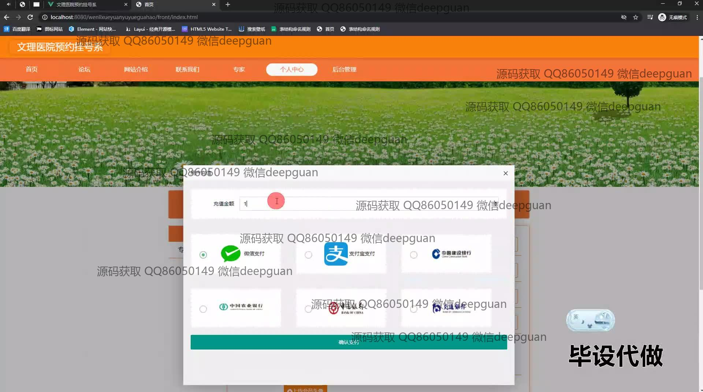
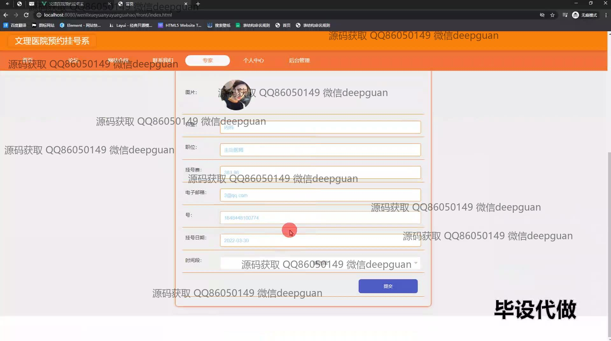
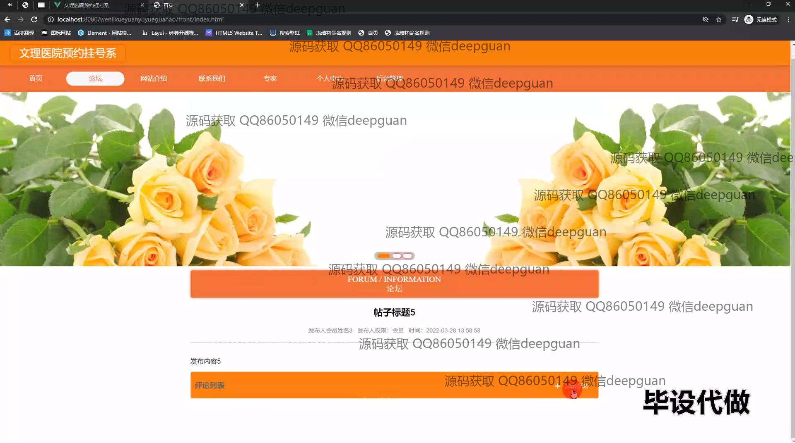
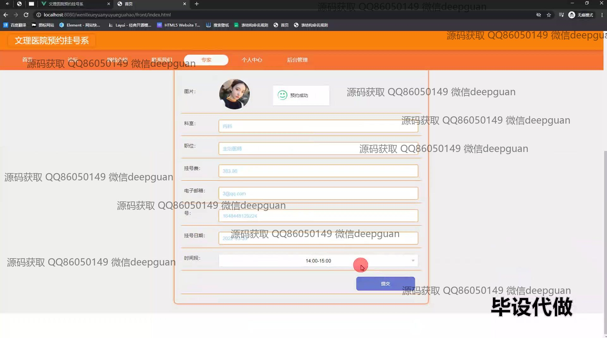
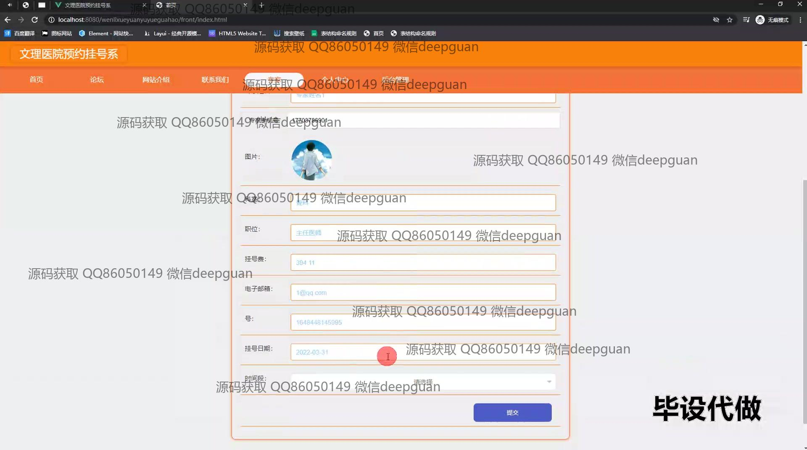

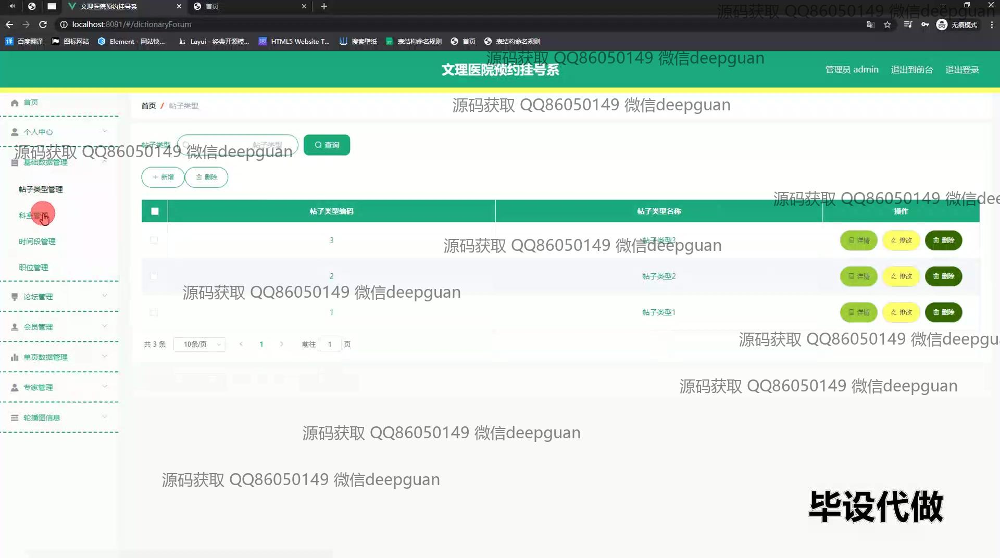
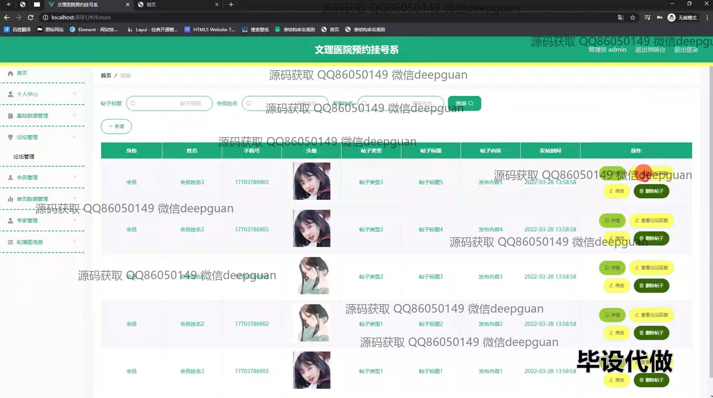

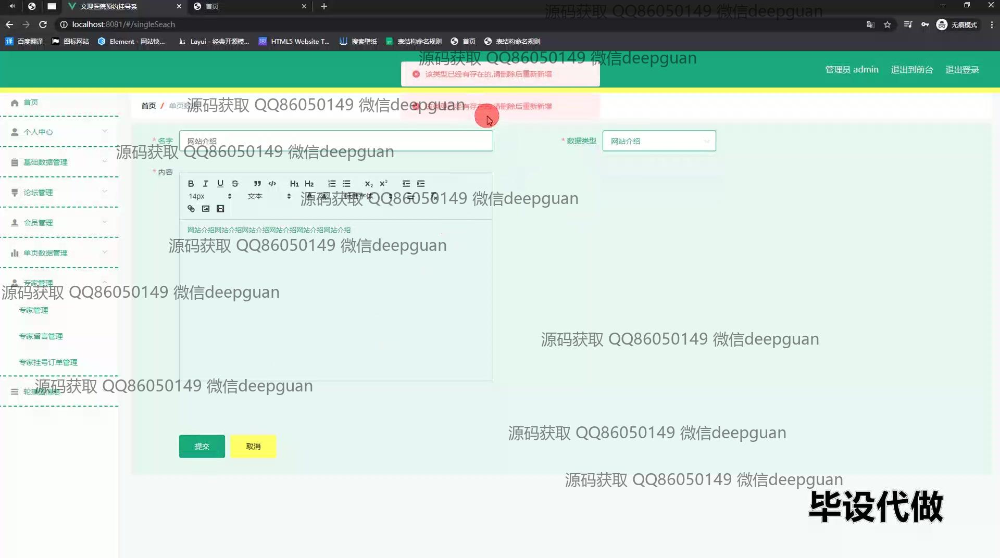
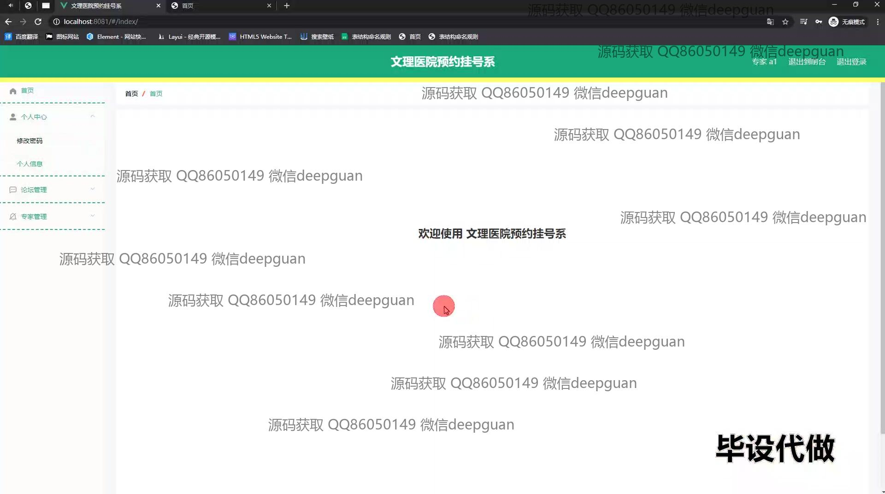
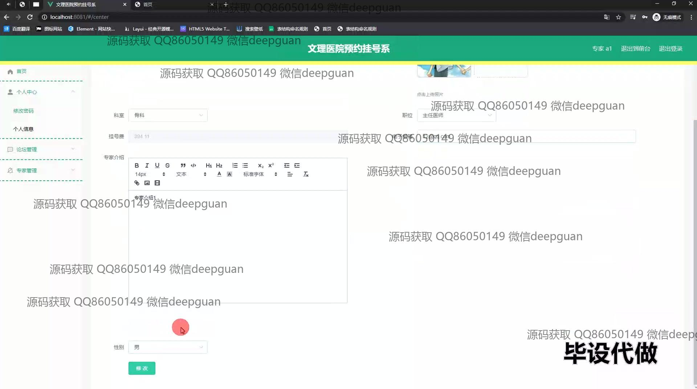
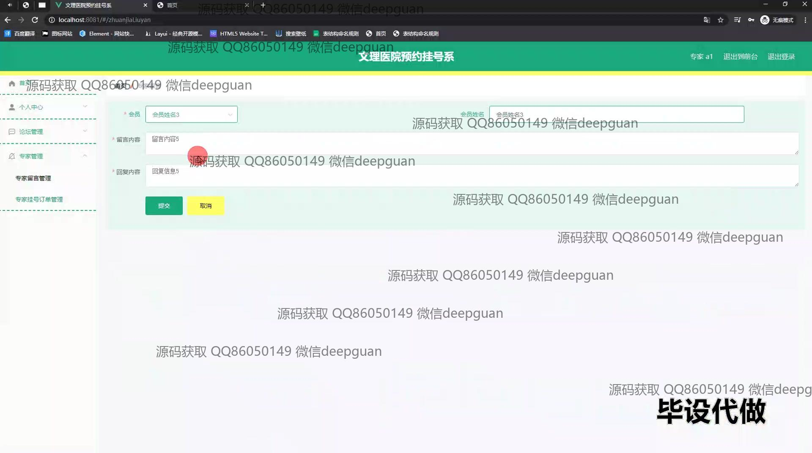

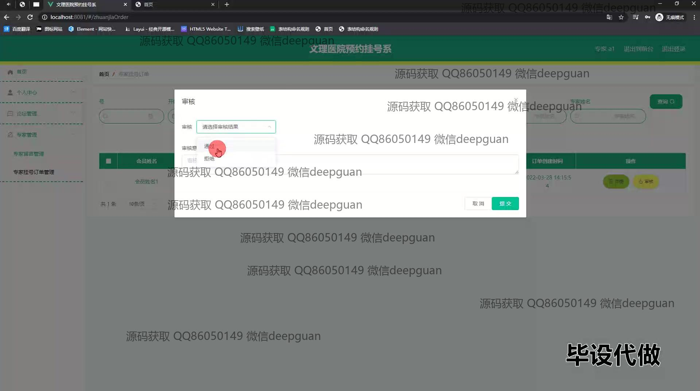
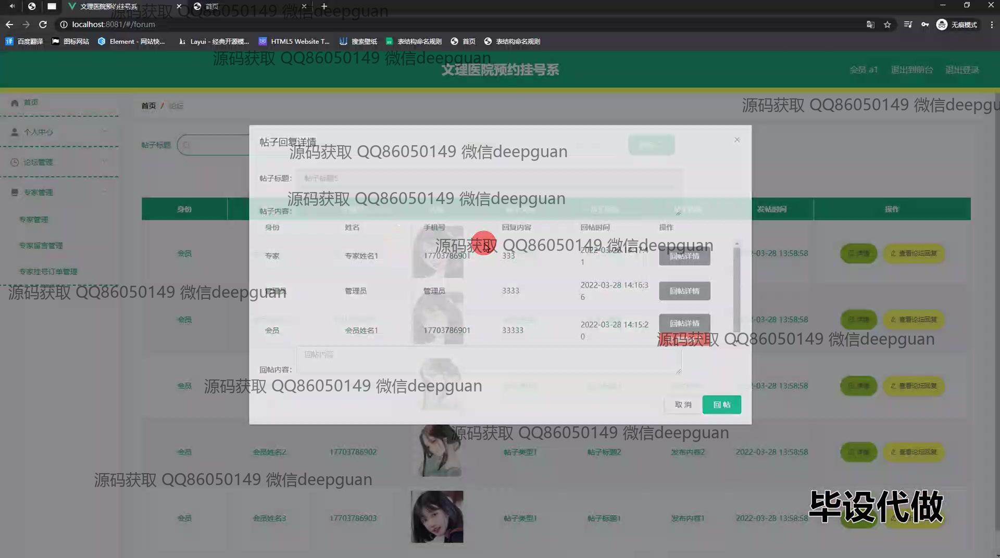

本代码来源于网络,仅供学习参考使用!

